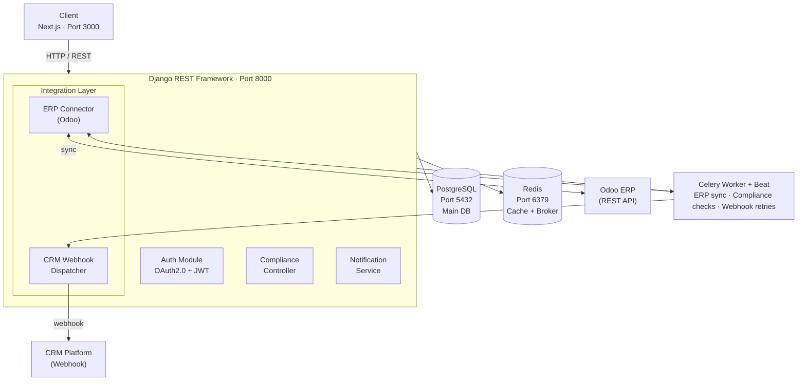

# Product Compliance Dashboard

A full-stack web application for tracking and managing product compliance with EU regulations (ESPR, REACH, RoHS). Built with Django REST Framework, Next.js, Celery, Redis, and PostgreSQL. Integrates with ERP systems (Odoo) and generic CRM webhooks for enterprise data synchronisation. Deployed on AWS EKS with Helm and Argo CD.

> **Status:** In development

---

## Table of Contents

- [Overview](#overview)
- [Features](#features)
- [Architecture](#architecture)
- [Tech Stack](#tech-stack)
- [Project Structure](#project-structure)
- [Getting Started](#getting-started)
- [Environment Variables](#environment-variables)
- [API Documentation](#api-documentation)
- [Kubernetes Deployment](#kubernetes-deployment)
- [CI/CD Pipeline](#cicd-pipeline)
- [Screenshots](#screenshots)
- [Roadmap](#roadmap)

---

## Overview

The Product Compliance Dashboard enables manufacturers and compliance teams to register products, track their regulatory status across multiple EU frameworks, and receive automated alerts when compliance status changes. The platform is designed around the requirements of the **Ecodesign for Sustainable Products Regulation (ESPR)** and supports bidirectional data sync with enterprise systems such as ERP and CRM platforms.

### Who is it for?

| Role | Capabilities |
|------|-------------|
| **Admin** | Full system access, user management, all products |
| **Manufacturer** | Manage own products, view compliance reports |
| **Viewer** | Read-only access to published compliance data |

---

## Features

### Backend
- **Product lifecycle management** — full CRUD for products and compliance records
- **Multi-regulation support** — track compliance per regulation (ESPR, REACH, RoHS) per product
- **Automated compliance checks** — scheduled Celery tasks re-evaluate compliance status on a configurable schedule
- **Notifications** — async email and in-app alerts when a product becomes non-compliant
- **OAuth 2.0 authentication** — Google login via `django-allauth`, JWT session management
- **Role-Based Access Control (RBAC)** — Admin, Manufacturer, Viewer roles with granular permissions
- **Redis caching** — compliance summary reports cached to reduce DB load
- **REST API** — fully documented with Swagger (drf-spectacular)

### Integrations
- **ERP sync (Odoo)** — async product data import from Odoo via REST API, triggered manually or on schedule via Celery Beat. Products, categories, and manufacturer data are mapped to the compliance data model automatically.
- **Generic CRM webhook** — outbound webhook notifications to any CRM platform when a product's compliance status changes. Configurable per organisation with payload mapping and retry logic.

### Frontend
- **Compliance dashboard** — overview of all products and their current regulatory status
- **Product management** — create, edit, and manage products with compliance attributes
- **Regulation filter** — filter products by regulation, status, or category
- **Notifications panel** — real-time alerts for compliance changes
- **Integration status** — view last ERP sync time and webhook delivery status
- **Responsive UI** — mobile-friendly design with Next.js and Tailwind CSS

### DevOps
- **Docker Compose** — full local development environment with hot reload
- **Kubernetes** — production deployment on AWS EKS with Helm charts
- **Argo CD** — GitOps-based continuous delivery
- **GitHub Actions** — CI/CD pipeline with automated testing, linting, and image building
- **Health checks** — liveness and readiness probes for all services
- **Horizontal Pod Autoscaler** — auto-scaling based on CPU/memory load

---

## Architecture



### Key Design Decisions

- **Django REST Framework** chosen for its mature ecosystem, built-in RBAC support, and excellent integration with Celery and Redis.
- **Redis** serves dual purpose: Celery message broker for async task queue, and caching layer for compliance summary reports.
- **Celery Beat** handles both scheduled compliance re-evaluation and periodic ERP sync tasks, with configurable intervals.
- **Integration Layer** is decoupled from core business logic — ERP and CRM connectors are independent Django apps, making it easy to add new integrations without touching compliance logic.
- **Generic CRM webhook** design allows any CRM to receive compliance change events without platform-specific implementation — payload structure is configurable per organisation.
- **Next.js** used over plain React for SSR support, improved SEO, and file-based routing, reducing frontend complexity.
- **PostgreSQL** with structured schema for compliance records, enabling complex queries across regulations and product categories.

---

## Tech Stack

| Layer | Technology | Purpose |
|-------|-----------|---------|
| Backend Framework | Django 5.x + DRF | REST API, business logic |
| Frontend | Next.js 14 + Tailwind CSS | UI, SSR |
| Authentication | OAuth 2.0 (Google) + JWT | Auth via django-allauth |
| Task Queue | Celery + Redis | Async compliance checks, ERP sync, webhook retries |
| Cache | Redis | Report caching |
| Database | PostgreSQL 16 | Main data store |
| ERP Integration | Odoo REST API | Product data sync |
| CRM Integration | Generic Webhook | Outbound compliance change notifications |
| API Docs | drf-spectacular (Swagger) | Auto-generated docs |
| Containerisation | Docker + Docker Compose | Local development |
| Orchestration | Kubernetes (AWS EKS) | Production deployment |
| Package Manager | Helm | K8s chart management |
| GitOps | Argo CD | Continuous delivery |
| CI/CD | GitHub Actions | Testing and image builds |
| Code Quality | black, ruff, mypy, pytest | Linting, typing, testing |

---

## Project Structure

```
product-compliance-dashboard/
├── backend/
│   ├── config/                  # Django settings (base, dev, prod)
│   ├── apps/
│   │   ├── accounts/            # User model, OAuth2.0, RBAC
│   │   ├── products/            # Product CRUD, compliance records
│   │   ├── compliance/          # Regulation models, status engine
│   │   ├── notifications/       # Async notification service
│   │   ├── integrations/        # Integration layer
│   │   │   ├── erp/             # Odoo connector (REST client, field mapping)
│   │   │   └── crm/             # Generic webhook dispatcher + retry logic
│   │   └── api/                 # DRF routers, serializers, views
│   ├── celery_app/              # Celery config and scheduled tasks
│   ├── tests/                   # pytest test suite
│   ├── Dockerfile
│   └── pyproject.toml
├── frontend/
│   ├── app/                     # Next.js app router
│   │   ├── dashboard/           # Main compliance dashboard
│   │   ├── products/            # Product management pages
│   │   ├── notifications/       # Notifications panel
│   │   └── integrations/        # ERP sync status, webhook config
│   ├── components/              # Reusable UI components
│   ├── lib/                     # API client, auth helpers
│   ├── Dockerfile
│   └── package.json
├── k8s/
│   ├── helm/
│   │   └── compliance-dashboard/
│   │       ├── Chart.yaml
│   │       ├── values.yaml
│   │       └── templates/
│   │           ├── backend-deployment.yaml
│   │           ├── frontend-deployment.yaml
│   │           ├── celery-deployment.yaml
│   │           ├── ingress.yaml
│   │           ├── configmap.yaml
│   │           └── secrets.yaml
│   └── argo/
│       └── application.yaml     # Argo CD app definition
├── .github/
│   └── workflows/
│       ├── ci.yml               # Test, lint, type-check
│       └── cd.yml               # Build and push Docker images
├── docker-compose.yml
├── docker-compose.prod.yml
└── README.md
```

---

## Getting Started

### Prerequisites

- Docker and Docker Compose
- Python 3.11+
- Node.js 20+
- Google OAuth credentials (for authentication)
- Odoo instance (local or cloud) for ERP integration (optional)

### Local Development

**1. Clone the repository**

```bash
git clone https://github.com/zoeleve/product-compliance-dashboard.git
cd product-compliance-dashboard
```

**2. Set up environment variables**

```bash
cp backend/.env.example backend/.env
cp frontend/.env.example frontend/.env.local
```

Fill in the required values (see [Environment Variables](#environment-variables)).

**3. Start all services with Docker Compose**

```bash
docker-compose up --build
```

This starts:
- Django API at `http://localhost:8000`
- Next.js frontend at `http://localhost:3000`
- PostgreSQL at `localhost:5432`
- Redis at `localhost:6379`
- Celery worker and Beat scheduler

**4. Run database migrations**

```bash
docker-compose exec backend python manage.py migrate
```

**5. Create a superuser**

```bash
docker-compose exec backend python manage.py createsuperuser
```

**6. Access the application**

| Service | URL |
|---------|-----|
| Frontend | http://localhost:3000 |
| Django Admin | http://localhost:8000/admin |
| API (Swagger) | http://localhost:8000/api/schema/swagger-ui |
| API (ReDoc) | http://localhost:8000/api/schema/redoc |

### Running Tests

```bash
# Backend tests
docker-compose exec backend pytest --cov=apps --cov-report=term-missing

# Frontend tests
docker-compose exec frontend npm run test
```

### Code Quality

```bash
# Format
docker-compose exec backend black .

# Lint
docker-compose exec backend ruff check .

# Type check
docker-compose exec backend mypy .
```

---

## Environment Variables

### Backend (`backend/.env`)

```env
# Django
SECRET_KEY=your-secret-key
DEBUG=True
ALLOWED_HOSTS=localhost,127.0.0.1

# Database
POSTGRES_DB=compliance_db
POSTGRES_USER=postgres
POSTGRES_PASSWORD=your-password
POSTGRES_HOST=db
POSTGRES_PORT=5432

# Redis
REDIS_URL=redis://redis:6379/0

# OAuth2.0 - Google
GOOGLE_CLIENT_ID=your-google-client-id
GOOGLE_CLIENT_SECRET=your-google-client-secret

# Celery
CELERY_BROKER_URL=redis://redis:6379/0
CELERY_RESULT_BACKEND=redis://redis:6379/0

# Email (for notifications)
EMAIL_HOST=smtp.gmail.com
EMAIL_PORT=587
EMAIL_HOST_USER=your-email
EMAIL_HOST_PASSWORD=your-app-password

# ERP Integration (Odoo)
ODOO_URL=http://your-odoo-instance
ODOO_DB=your-odoo-db
ODOO_USERNAME=your-odoo-user
ODOO_API_KEY=your-odoo-api-key
ERP_SYNC_INTERVAL_MINUTES=60

# CRM Webhook
CRM_WEBHOOK_TIMEOUT_SECONDS=10
CRM_WEBHOOK_MAX_RETRIES=3
```

### Frontend (`frontend/.env.local`)

```env
NEXT_PUBLIC_API_URL=http://localhost:8000/api
NEXT_PUBLIC_GOOGLE_CLIENT_ID=your-google-client-id

# NextAuth
NEXTAUTH_URL=http://localhost:3000
NEXTAUTH_SECRET=your-nextauth-secret

# OAuth2.0 - Google (server-side, used by the NextAuth GoogleProvider)
GOOGLE_CLIENT_ID=your-google-client-id
GOOGLE_CLIENT_SECRET=your-google-client-secret
```

---

## Authentication

The dashboard uses **OAuth 2.0 (Google)** for sign-in, bridged to short-lived **JWT** access/refresh tokens for API calls.

### Flow

```mermaid
sequenceDiagram
    actor U as User
    participant B as Browser (Next.js)
    participant G as Google OAuth 2.0
    participant D as Django (GoogleLoginView)
    participant N as NextAuth session

    U->>B: Click "Continue with Google"
    B->>G: 1. Sign in with Google
    G-->>B: 2. id_token (OIDC)
    B->>D: 3. POST /api/auth/google/ { id_token }
    Note over D: verify id_token signature & audience<br/>against GOOGLE_CLIENT_ID (google-auth)<br/>get_or_create User by verified email<br/>issue SimpleJWT access + refresh tokens
    D-->>B: 4. { access, refresh, user }
    B->>N: store Django access token
    Note over N: attached as Authorization: Bearer &lt;token&gt;<br/>on every API request (lib/api.ts)
```

1. The user clicks **Continue with Google** on `/login` (`next-auth` `signIn("google")`).
2. NextAuth completes the Google OAuth 2.0 / OIDC handshake in the browser and receives an `id_token`.
3. NextAuth's `jwt` callback (`frontend/lib/auth.ts`) forwards that `id_token` to the Django backend at `POST /api/auth/google/`.
4. Django verifies the token's signature and audience directly with Google (no client secret exchange needed for this leg), creates the user on first login, and returns a SimpleJWT `access`/`refresh` pair plus the user's profile.
5. The access token is stored in the NextAuth session and attached to every subsequent API request; `POST /api/auth/token/refresh/` is used to renew it.

### Setting up Google OAuth credentials

1. In the [Google Cloud Console](https://console.cloud.google.com/apis/credentials), create an **OAuth 2.0 Client ID** (Web application).
2. Add authorized redirect URI: `http://localhost:3000/api/auth/callback/google` (adjust the host for staging/prod).
3. Copy the generated Client ID / Secret into both env files:
   - `backend/.env`: `GOOGLE_CLIENT_ID`, `GOOGLE_CLIENT_SECRET` (used to verify the token audience).
   - `frontend/.env.local`: `GOOGLE_CLIENT_ID`, `GOOGLE_CLIENT_SECRET` (used by the NextAuth provider), plus `NEXTAUTH_URL` and a random `NEXTAUTH_SECRET`.

---

## API Documentation

The REST API is fully documented via Swagger UI at `/api/schema/swagger-ui`.

### Core Endpoints

| Method | Endpoint | Description | Auth Required |
|--------|----------|-------------|---------------|
| `POST` | `/api/auth/google/` | Exchange a Google `id_token` for a Django JWT pair (creates the user on first login) | No |
| `POST` | `/api/auth/token/` | Obtain a JWT pair via username/password | No |
| `POST` | `/api/auth/token/refresh/` | Refresh JWT token | No |
| `GET`/`PATCH` | `/api/auth/profile/` | Get or update the current user's profile | Yes |
| `GET` | `/api/products/` | List all products | Yes |
| `POST` | `/api/products/` | Create a product | Yes (Manufacturer) |
| `GET` | `/api/products/{id}/` | Get product detail | Yes |
| `PUT` | `/api/products/{id}/` | Update product | Yes (Owner) |
| `DELETE` | `/api/products/{id}/` | Delete product | Yes (Admin) |
| `GET` | `/api/products/{id}/compliance/` | Get compliance status | Yes |
| `GET` | `/api/compliance/regulations/` | List regulations | Yes |
| `GET` | `/api/notifications/` | Get user notifications | Yes |
| `POST` | `/api/notifications/{id}/read/` | Mark as read | Yes |
| `POST` | `/api/integrations/erp/sync/` | Trigger manual ERP sync | Yes (Admin) |
| `GET` | `/api/integrations/erp/status/` | Last sync status and timestamp | Yes |
| `POST` | `/api/integrations/crm/webhooks/` | Register a CRM webhook | Yes (Admin) |
| `GET` | `/api/integrations/crm/webhooks/` | List registered webhooks | Yes (Admin) |
| `DELETE` | `/api/integrations/crm/webhooks/{id}/` | Remove a webhook | Yes (Admin) |

---

## Kubernetes Deployment

### Prerequisites

- AWS CLI configured
- `kubectl` installed
- Helm 3.x installed
- Argo CD installed on the cluster

### AWS EKS Setup

**1. Create EKS cluster**

```bash
eksctl create cluster \
  --name compliance-dashboard \
  --region eu-west-1 \
  --nodegroup-name standard-workers \
  --node-type t3.medium \
  --nodes 2
```

**2. Deploy with Helm**

```bash
helm upgrade --install compliance-dashboard ./k8s/helm/compliance-dashboard \
  --namespace compliance \
  --create-namespace \
  --values ./k8s/helm/compliance-dashboard/values.yaml \
  --set backend.image.tag=latest \
  --set frontend.image.tag=latest
```

**3. Configure Argo CD**

```bash
kubectl apply -f k8s/argo/application.yaml
```

Argo CD will watch the repository and automatically sync any changes to the cluster.

### Kubernetes Resources

| Resource | Description |
|----------|-------------|
| `backend-deployment` | Django API (2 replicas, HPA enabled) |
| `frontend-deployment` | Next.js (2 replicas) |
| `celery-deployment` | Celery worker (1 replica) |
| `celery-beat-deployment` | Celery Beat scheduler (1 replica) |
| `ingress` | NGINX Ingress with TLS |
| `configmap` | Non-sensitive configuration |
| `secrets` | Sensitive credentials (base64 encoded) |
| `hpa` | Horizontal Pod Autoscaler for backend |

### Health Checks

All deployments include liveness and readiness probes:

```yaml
livenessProbe:
  httpGet:
    path: /api/health/
    port: 8000
  initialDelaySeconds: 30
  periodSeconds: 10
readinessProbe:
  httpGet:
    path: /api/health/
    port: 8000
  initialDelaySeconds: 10
  periodSeconds: 5
```

---

## CI/CD Pipeline

### GitHub Actions Workflows

**CI (`ci.yml`)** — triggered on every push and pull request:
1. Run pytest with coverage report
2. Run ruff linting
3. Run mypy type checking
4. Run black formatting check
5. Run frontend tests

**CD (`cd.yml`)** — triggered on merge to `main`:
1. Build Docker images for backend and frontend
2. Push images to AWS ECR
3. Update Helm values with new image tags
4. Argo CD detects the change and syncs to EKS

---

## Screenshots

### Compliance Dashboard

*Overview of all products and their compliance status across regulations*

### Product Management

*Create and manage products with compliance attributes*

### Compliance Detail View

*Per-product compliance status across ESPR, REACH, and RoHS*

### ERP Sync and Integration Status

*ERP sync status, last run timestamp, and CRM webhook configuration*

### Notifications Panel

*Real-time alerts for compliance status changes*

### Swagger API Documentation

*Auto-generated REST API documentation*

### Kubernetes Dashboard (Argo CD)

*GitOps deployment view in Argo CD*

---

## Roadmap

- [ ] Webhook support for additional third-party integrations
- [ ] Multi-tenancy support for SaaS deployment
- [ ] Audit log with full change history per product
- [ ] PDF compliance report export
- [ ] SAP ERP connector

---

## License

MIT License. See [LICENSE](LICENSE) for details.
